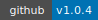
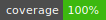

PyVDF - |version|
=================

|PyPI Version|\  |GitHub Release|\  |Coverage Status|

.. automodule:: PyVDF
   :members:

-------------------

https://developer.valvesoftware.com/wiki/KeyValues

Documentation
-------------

.. toctree:: API
.. toctree:: Examples

Installation
------------
``pip install PyVDF``

Bugs
----
Please report any bugs here:

https://github.com/amreuland/PyVDF/issues

.. |PyPI Version| image:: img/pypi.svg
   :target: https://pypi.python.org/pypi/PyVDF/1.0.4

